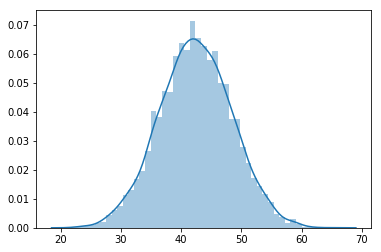
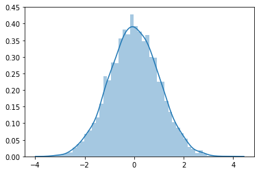

# Standard Normal Distribution - Lab

## Introduction

In the previous lesson, we looked at the formula and a few toy examples to explain an observation's standard score and data standardization for normally distributed data. In this lab, we will standardize and visualize some normal distributions.

## Objectives

You will be able to:

* Calculate and interpret z-scores for observations
* Visualize the data before-after standardization to visually inspect the results. 

## Let's get started

> A Z-score tells us “how many standard deviations above or below the mean.” Every time you obtain a Z-score, use “above” or “below” in your phrasing.

The yields of apples trees in an orchard has been recorded in the file `yield.csv`. Each observation is recorded by weighing apples from trees (in pounds) and adding their weights. There are 5000 observations in total for this data. 

**1. Load, visualize and give general comments on the dataset. Use pandas for loading and inspecting the data.**


```python
# Import libraries
import numpy as np
import seaborn as sns
import pandas as pd

# Read the yield data as a dataframe
df = pd.read_csv('yield.csv')
df.head()
```


<div>
<style scoped>
    .dataframe tbody tr th:only-of-type {
        vertical-align: middle;
    }

    .dataframe tbody tr th {
        vertical-align: top;
    }

    .dataframe thead th {
        text-align: right;
    }
</style>
<table border="1" class="dataframe">
  <thead>
    <tr style="text-align: right;">
      <th></th>
      <th>0</th>
    </tr>
  </thead>
  <tbody>
    <tr>
      <th>0</th>
      <td>39.741234</td>
    </tr>
    <tr>
      <th>1</th>
      <td>39.872055</td>
    </tr>
    <tr>
      <th>2</th>
      <td>44.331164</td>
    </tr>
    <tr>
      <th>3</th>
      <td>46.600623</td>
    </tr>
    <tr>
      <th>4</th>
      <td>40.694984</td>
    </tr>
  </tbody>
</table>
</div>


```python
sns.distplot(df)
```

    /Users/matthew.mitchell/anaconda3/lib/python3.6/site-packages/matplotlib/axes/_axes.py:6462: UserWarning: The 'normed' kwarg is deprecated, and has been replaced by the 'density' kwarg.
      warnings.warn("The 'normed' kwarg is deprecated, and has been "


    <matplotlib.axes._subplots.AxesSubplot at 0x10ce5da20>





```python
# Your comments about the data here. 

# The data is normally distributed as shown by the density curve. 
```

**2. Write a simple sentence to explain what does each value represent in this data?**


```python
# Your answer here

# Each value represents the a yield from a single tree in terms of total weight of apples
# that were obtained from this tree. 
```

**3. What does the 3-sigma rule say about yields of trees ?**


```python
# Perform any calculations necessary here
mean = df.mean()
sd = df.std()
mean,sd
```


    (0    42.407624
     dtype: float64, 0    6.003697
     dtype: float64)


```python
# Write your answer here 

# mean value is 42.4 and standard deviation is 6 (rounded off)
# 68% of tree yields have weight between (42.4 - 6) 36.4 and (42.4 - 6) 48.4 pounds; 
# 95% between 30.4 and 54.4; 
# Almost all between 24.4 and 60.4 pounds
```

**4. Compute the Z-score for a tree yielding 35 pounds of apples. Interpret this Z-score.**


```python
# Calculate z
z = (35 - mean)/sd
z
```


    0   -1.233844
    dtype: float64


```python
# Interpret the result

# This tree’s yield is 1.23 standard deviations below the mean yield.
```

**5. Suppose a tree has a Z-score of 1.85. Interpret this Z-score. What is the yield of this tree?**


```python
# Interpret the z score

# This tree’s yield is 1.85 standard deviations above the mean
```


```python
X = mean + 1.85*sd
X
```


    0    53.514462
    dtype: float64


```python
# What is the yield ?

# Yield of this tree is 53.5 pounds. 
```

**6. Convert each tree’s yield is converted to a Z-score so that “new” derived variable is “Z-score for weight”. The units are still the apple trees. For the data set of all Z-scores:**
* What is the shape? 
* The mean? 
* The standard deviation?


```python
z_data = [(x - df['0'].mean())/df['0'].std() for x in df['0']]
sns.distplot(z_data)
mean = np.mean(np.array(z_data))
sd = np.std((np.array(z_data)))
print ('Mean:', round(mean,2))
print ('SD:', round(sd,2))
```

    /Users/matthew.mitchell/anaconda3/lib/python3.6/site-packages/matplotlib/axes/_axes.py:6462: UserWarning: The 'normed' kwarg is deprecated, and has been replaced by the 'density' kwarg.
      warnings.warn("The 'normed' kwarg is deprecated, and has been "


    Mean: 0.0
    SD: 1.0





```python
# Your observations
# It is a standard normal distribution
# Mean is 0 (it is a very small figure that rounds off to 0)
# SD is 1
# This is obvious because we standardised the whole distribution., 
```

## Summary

In this lab, you practiced your knowledge on the standard normal distribution!

